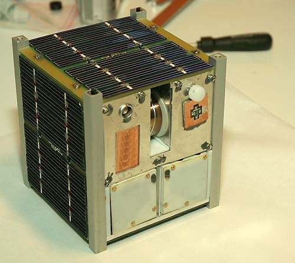
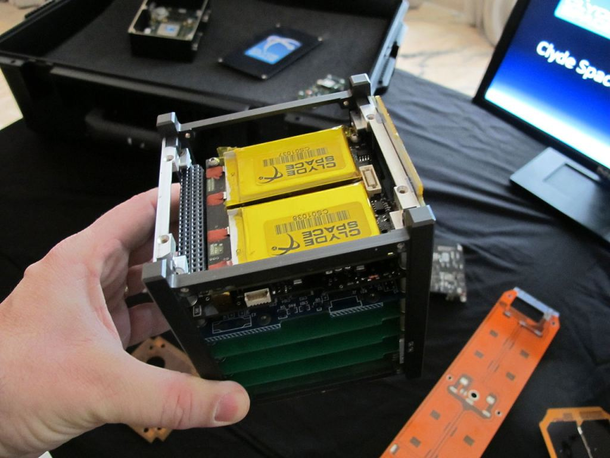
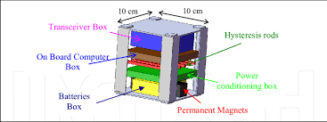
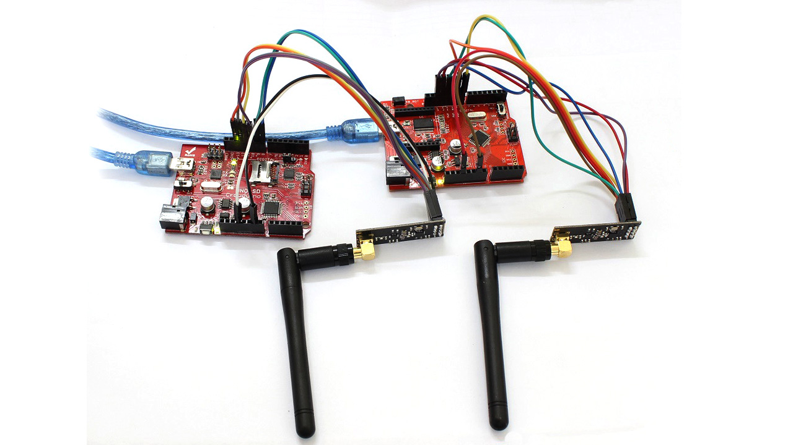
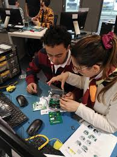
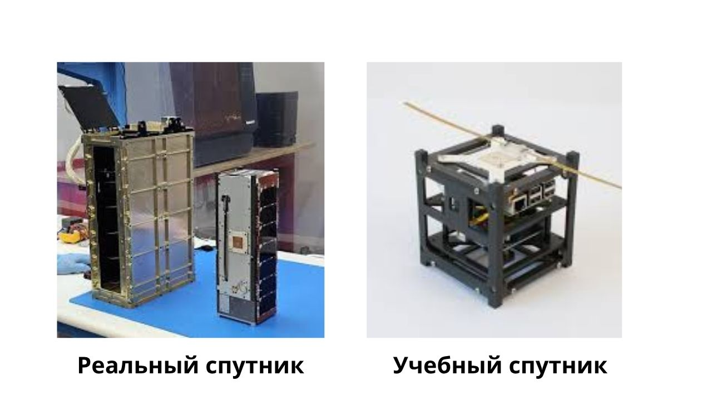
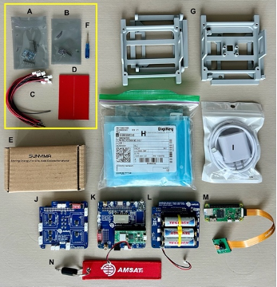
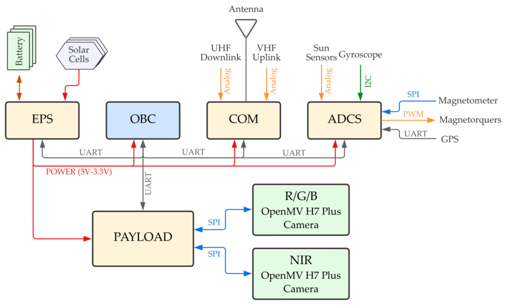

Введение в CubeSat
==================

Что такое CubeSat
-----------------

**CubeSat** - это малый спутник, построенный по стандартному модульному формату.
Идея CubeSat появилась для того, чтобы сделать разработку спутников более
доступной для университетов, исследовательских лабораторий, образовательных
организаций и небольших инженерных команд.

В отличие от больших космических аппаратов, CubeSat имеет компактный размер,
стандартизированную конструкцию и может использовать готовые электронные модули.
Благодаря этому такие спутники стали популярны в образовании, научных
экспериментах, тестировании новых технологий и демонстрационных миссиях.

   Фото для вставки: "реальный CubeSat крупным планом на выставочном или
   лабораторном стенде". Ищите по запросам: "CubeSat close-up", "CubeSat
   engineering model", "CubeSat in lab".

CubeSat можно представить как миниатюрную инженерную платформу, внутри которой
объединяются разные подсистемы:

- бортовой компьютер;
- система питания;
- датчики;
- система связи;
- полезная нагрузка;
- программное обеспечение;
- наземная станция для приема данных.

Именно поэтому CubeSat хорошо подходит для обучения: он позволяет изучать не
одну отдельную тему, а сразу целую систему, где электроника, программирование,
механика и связь работают вместе.

Что такое формат 1U
-------------------

Базовый размер CubeSat называется **1U**.

Формат **1U** означает один стандартный кубический модуль размером примерно:
**10 x 10 x 10 см**.

Буква **U** происходит от слова **Unit**, то есть "единица" или "модуль".

   Фото для вставки: "наглядный размер CubeSat 1U (10x10x10 см) рядом с
   линейкой, ладонью или другим знакомым объектом масштаба".

На основе 1U могут строиться более крупные форматы:

.. list-table:: Форматы CubeSat
   :header-rows: 1
   :widths: 15 25 60

   * - Формат
     - Примерный размер
     - Описание
   * - 1U
     - 10 x 10 x 10 см
     - Один базовый модуль
   * - 2U
     - 10 x 10 x 20 см
     - Два модуля 1U
   * - 3U
     - 10 x 10 x 30 см
     - Три модуля 1U
   * - 6U
     - 20 x 10 x 30 см
     - Более крупная исследовательская платформа
   * - 12U
     - 20 x 20 x 30 см
     - Расширенный формат для сложных миссий

В нашем образовательном наборе используется формат **1U**, потому что он
компактный, удобный для сборки, подходит для 3D-печати корпуса и позволяет
разместить основные электронные компоненты внутри ограниченного пространства.

Такой формат помогает ученику понять один из главных принципов инженерии
космических систем: **каждый компонент должен быть установлен осмысленно,
потому что место, питание и масса всегда ограничены**.

   Фото для вставки: "внутреннее расположение модулей в CubeSat: плата, кабели,
   питание, датчики". Лучше брать фото с видимой плотной компоновкой.

Где используются CubeSat
------------------------

CubeSat используются в разных областях.

Образование
~~~~~~~~~~~

Университеты, школы и инженерные кружки используют CubeSat для изучения
электроники, программирования, датчиков, радиосвязи и основ космической
инженерии.

Научные эксперименты
~~~~~~~~~~~~~~~~~~~~

CubeSat могут применяться для измерения параметров окружающей среды, изучения
атмосферы, магнитного поля Земли, радиосигналов и других физических явлений.

Тестирование технологий
~~~~~~~~~~~~~~~~~~~~~~~

Компании и исследовательские команды используют CubeSat для проверки новых
компонентов, датчиков, камер, систем связи, алгоритмов управления и программного
обеспечения.

Дистанционное зондирование
~~~~~~~~~~~~~~~~~~~~~~~~~~

Некоторые CubeSat оснащаются камерами и другими сенсорами для наблюдения Земли,
мониторинга природных процессов, сельского хозяйства, климата и инфраструктуры.

Связь и телеметрия
~~~~~~~~~~~~~~~~~~

CubeSat могут передавать данные на наземные станции, что позволяет изучать
принципы радиосвязи, пакетной передачи данных и работы телеметрических систем.

   Фото для вставки: "ноутбук/ПК + антенна или радиомодуль + график телеметрии".
   Ищите что-то, что визуально показывает связку спутник-земля.

Почему CubeSat удобен для обучения
----------------------------------

CubeSat удобен для обучения, потому что он объединяет несколько инженерных
направлений в одном проекте.

В процессе работы с набором ученик знакомится с такими темами, как:

- основы микроконтроллеров;
- подключение датчиков;
- работа с интерфейсами I2C, SPI и UART;
- сбор данных с датчиков;
- запись телеметрии на карту памяти;
- передача данных на наземную станцию;
- проектирование корпуса;
- сборка электронного устройства;
- отладка ошибок;
- анализ полученных данных.

Главное преимущество CubeSat как образовательного проекта - это системное
мышление.

Ученик видит не отдельный датчик, который просто выводит температуру в Serial
Monitor, а полноценную модель спутника, где каждый модуль выполняет свою роль.
Даже если устройство не запускается в космос, оно позволяет понять, как устроены
реальные спутниковые системы на базовом уровне.

Образовательный CubeSat помогает ответить на важные инженерные вопросы:

- как устройство получает данные;
- как оно сохраняет данные;
- как оно передает данные;
- как оно питается;
- как разные модули взаимодействуют друг с другом;
- как проверить, что система работает правильно;
- как найти ошибку, если система не работает.

Это делает CubeSat хорошей платформой для практического STEM-обучения.

   Фото для вставки: "учебная аудитория или кружок, где студенты/школьники
   собирают электронику CubeSat на столах".

Чем отличается настоящий космический CubeSat от учебного макета
----------------------------------------------------------------

Важно понимать, что образовательный CubeSat и настоящий космический CubeSat -
это не одно и то же.

Настоящий космический аппарат должен выдерживать запуск ракеты, вибрации,
перепады температуры, вакуум, радиацию и строгие требования безопасности.
Его компоненты проходят испытания, а конструкция должна соответствовать
требованиям запускающей организации.

Учебный CubeSat не предназначен для запуска в космос. Его задача другая:
показать основные принципы работы спутниковой системы в безопасном и доступном
формате.

.. list-table:: Сравнение настоящего и учебного CubeSat
   :header-rows: 1
   :widths: 50 50

   * - Настоящий CubeSat
     - Учебный CubeSat
   * - Предназначен для запуска в космос
     - Предназначен для обучения
   * - Проходит строгие испытания
     - Используется в классе, лаборатории или кружке
   * - Использует более надежные компоненты
     - Использует доступные образовательные модули
   * - Работает в условиях космоса
     - Работает на Земле
   * - Имеет реальные миссионные задачи
     - Имитирует спутниковую миссию
   * - Требует сложной сертификации
     - Подходит для практических занятий

Несмотря на отличия, учебный CubeSat сохраняет главную идею настоящего спутника:
**это компактная система, в которой есть питание, вычисления, датчики, связь и
полезная нагрузка**.

   Фото для вставки: "сравнение двух вариантов: flight model vs educational
   prototype". Можно сделать коллаж из двух изображений.

Поэтому такой макет можно использовать как первый шаг к изучению космической
инженерии, робототехники, embedded-разработки и системного проектирования.

Наш образовательный набор CubeSat 1U
------------------------------------

Наш набор CubeSat 1U - это учебная инженерная платформа, которая помогает
ученикам понять, как устроен малый спутник и как взаимодействуют его основные
подсистемы.

Набор не является настоящим космическим аппаратом и не предназначен для запуска
в космос. Его цель - обучение через практическую сборку, подключение компонентов,
программирование и анализ данных.

С помощью набора ученик сможет:

- собрать корпус CubeSat формата 1U;
- установить электронные компоненты внутри корпуса;
- подключить датчики и модули связи;
- загрузить программу на микроконтроллер;
- получать данные с датчиков;
- сохранять телеметрию;
- передавать данные на наземную станцию;
- анализировать работу системы;
- выполнять учебные миссии.

Набор можно использовать на занятиях по робототехнике, электронике,
программированию, физике, информатике и инженерному проектированию.

   Фото для вставки: "разложенный комплект: корпус 1U, платы, датчики, провода,
   крепеж, инструменты".

Что изучает ученик через этот набор
-----------------------------------

Работая с образовательным CubeSat 1U, ученик изучает не только отдельные
компоненты, но и полный цикл создания инженерной системы.

1. Механику и конструкцию
~~~~~~~~~~~~~~~~~~~~~~~~~

Ученик узнает, как устроен корпус CubeSat, как размещаются компоненты внутри
ограниченного объема и почему важно учитывать размеры, крепления и доступ к
разъемам.

2. Электронику
~~~~~~~~~~~~~~

Ученик учится подключать датчики, модули питания, индикаторы, карту памяти и
модуль связи. Также он знакомится с базовыми принципами питания, общих линий GND
и правильного подключения сигналов.

3. Интерфейсы связи
~~~~~~~~~~~~~~~~~~~

В наборе используются разные способы обмена данными между модулями:

- **I2C** - для подключения датчиков;
- **SPI** - для модулей памяти или радиосвязи;
- **UART** - для GPS-модуля или отладки;
- **GPIO** - для светодиодов, кнопок и звуковой индикации.

4. Программирование
~~~~~~~~~~~~~~~~~~~

Ученик пишет и загружает код на микроконтроллер, получает данные с датчиков,
обрабатывает их и выводит результат в Serial Monitor или на наземную станцию.

5. Телеметрию
~~~~~~~~~~~~~

Телеметрия - это данные о состоянии системы. Например:

- температура;
- давление;
- влажность;
- ускорение;
- ориентация;
- координаты;
- состояние питания;
- статус записи на карту памяти;
- статус связи.

Через телеметрию ученик понимает, как спутник "сообщает" о своем состоянии.

6. Наземную станцию
~~~~~~~~~~~~~~~~~~~

Наземная станция принимает данные от CubeSat. В учебном наборе это может быть
второй микроконтроллер, компьютер, Serial Monitor, веб-интерфейс или простая
программа для отображения телеметрии.

7. Отладку и поиск ошибок
~~~~~~~~~~~~~~~~~~~~~~~~~

В реальной инженерии устройство почти никогда не работает идеально с первого
раза. Ученик учится проверять подключение, читать логи, искать ошибки в коде,
тестировать датчики и понимать, почему система работает неправильно.

Это один из самых важных навыков, потому что инженерия без отладки - это просто
вера в чудо с проводами.

Итог
----

CubeSat 1U - это компактная модель спутниковой системы, которая хорошо подходит
для практического обучения.

Через этот набор ученик знакомится с основами космической инженерии,
embedded-систем, электроники, программирования, датчиков, телеметрии и
беспроводной передачи данных.

Главная цель набора - не просто собрать красивый куб, а понять, как работает
инженерная система: от питания и датчиков до программного обеспечения и передачи
данных на наземную станцию.

   Фото/иллюстрация для вставки: "простая блок-схема: питание -> контроллер ->
   датчики/память/связь -> наземная станция". Подойдет и векторная схема.

