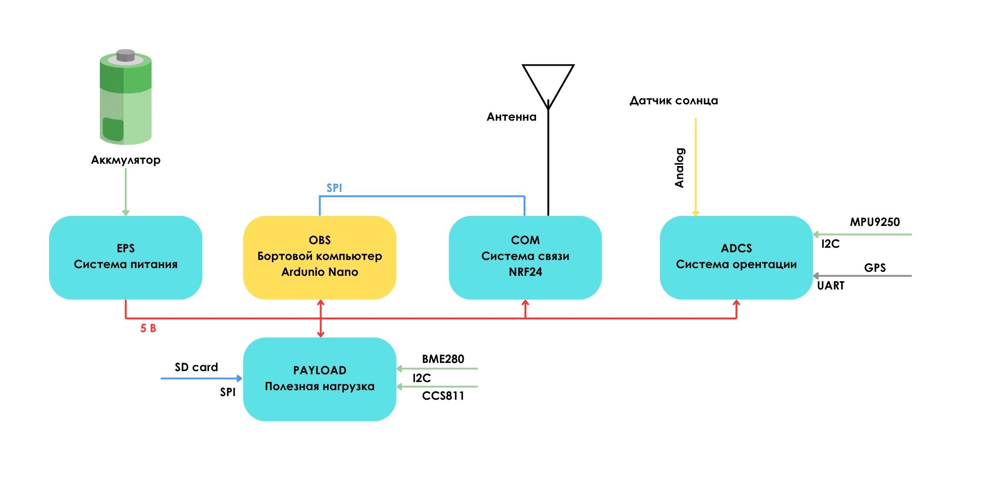
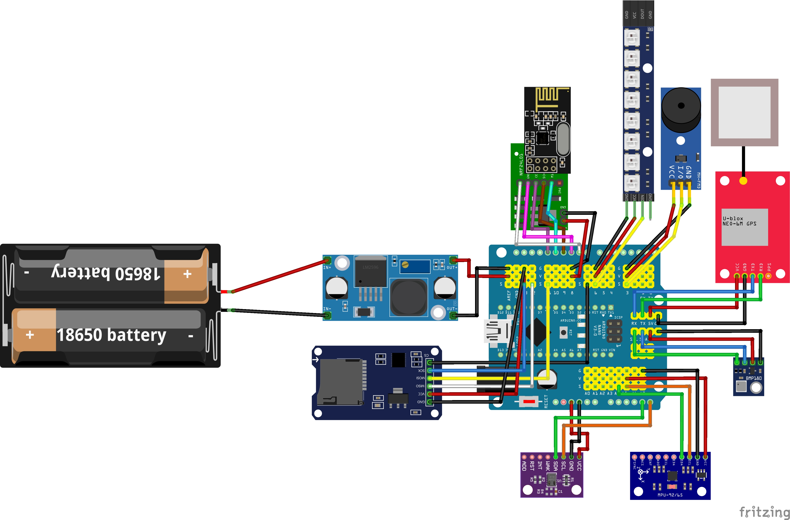

Схема подключения
=================

В данном разделе показано, как устроена электрическая часть учебного CubeSat и как
отдельные модули объединяются в единую систему.

Система построена вокруг **Arduino Nano**, который выполняет роль бортового
компьютера и связывает между собой датчики, модуль связи, систему хранения
данных и средства индикации.

Два уровня описания:

1. **Структурная блок-схема** — из каких подсистем состоит учебный CubeSat.
2. **Схема подключения модулей** — к каким пинам Arduino Nano подключён каждый
   компонент.

Подсистемы учебного CubeSat
----------------------------

EPS — Electrical Power System
~~~~~~~~~~~~~~~~~~~~~~~~~~~~~

**EPS (Electrical Power System)** — система питания учебного CubeSat.

Она включает:

- источник питания;
- распределение напряжения **5V** и **3.3V**;
- питание Arduino Nano и подключённых модулей;
- питание датчиков, радиомодуля, GPS и системы индикации.

Основная задача EPS — обеспечить стабильное питание всех подсистем набора.

OBC — On-Board Computer
~~~~~~~~~~~~~~~~~~~~~~~~

**OBC (On-Board Computer)** — бортовой компьютер спутника.

В данном наборе его роль выполняет **Arduino Nano**. Он отвечает за:

- опрос датчиков;
- обработку измерений;
- запись телеметрии на карту памяти;
- передачу данных по радиоканалу;
- управление индикацией и звуковым маяком.

Arduino Nano является центральным узлом всей системы.

COM — Communication System
~~~~~~~~~~~~~~~~~~~~~~~~~~~

**COM (Communication System)** — система связи учебного CubeSat.

В наборе для передачи телеметрии используется модуль **nRF24L01+**. Он позволяет
передавать данные с бортового компьютера на наземную станцию.

Через подсистему COM могут передаваться:

- показания датчиков;
- координаты GPS;
- служебная телеметрия;
- состояние питания и работы системы.

ADCS — система определения ориентации
~~~~~~~~~~~~~~~~~~~~~~~~~~~~~~~~~~~~~~~

**ADCS (Attitude Determination and Control System)** — упрощённая система
определения ориентации.

В учебном наборе она предназначена не для активного управления положением
спутника, а для оценки его положения и ориентации в пространстве.

В состав ADCS входят:

- **MPU9250** — измерение ускорения, угловой скорости и магнитного поля;
- **GPS-модуль** — координаты, скорость и время;
- **солнечные панели / датчики освещённости** — при наличии могут использоваться как
  простейшие ориентиры относительно Солнца.

Эта подсистема позволяет проводить эксперименты по оценке движения и ориентации.

PAYLOAD — полезная нагрузка
~~~~~~~~~~~~~~~~~~~~~~~~~~~

**PAYLOAD** — полезная нагрузка учебного CubeSat: модули для экспериментов и сбора
данных.

В состав полезной нагрузки входят:

- **BME280** — температура, давление и влажность;
- **CCS811** — параметры качества воздуха и газовой среды.

Эти датчики позволяют выполнять учебные эксперименты и собирать данные об окружающей
среде.

.. note::

   Модуль **microSD** в прямом смысле не является полезной нагрузкой — это подсистема
   хранения данных для записи телеметрии и результатов измерений.

Логика соединения подсистем
----------------------------

Все подсистемы соединяются через **Arduino Nano**:

- датчики **MPU9250**, **BME280** и **CCS811** — шина **I2C**;
- **nRF24L01+** и **microSD** — шина **SPI**;
- **GPS GY-NEO-6M** — **UART**: в прошивке **main_full** используется аппаратный
  ``Serial`` (**D0** = RX), скорость **9600 baud**;
- **buzzer** и адресная **LED-лента** — цифровые пины Arduino;
- питание модулей распределяется через подсистему **EPS**.

Структурная блок-схема
~~~~~~~~~~~~~~~~~~~~~~~

   Структурная блок-схема подсистем учебного CubeSat.

Схема подключения модулей (макет / Fritzing)
~~~~~~~~~~~~~~~~~~~~~~~~~~~~~~~~~~~~~~~~~~~~~

Ниже — электрическая схема подключения модулей к Arduino Nano (экспорт из проекта
**Fritzing**, файл ``CubeSat.fzz`` в корне репозитория).

   Схема подключения модулей учебного CubeSat.

Основные интерфейсы подключения
-------------------------------

**I2C** — датчики:

- MPU9250
- BME280
- CCS811

**SPI** — модули:

- nRF24L01+
- microSD module

**UART** — GPS GY-NEO-6M на **D0** (см. прошивку **main_full**).

**GPIO** — зуммер и адресная LED-лента (WS2812).

Радиоканал: **nRF24L01+** по **SPI**, библиотека **RF24** (в коде ``PIN_NRF_CE``,
``PIN_NRF_CS``).

Примечания по подключению
-------------------------

- Общая **GND** для всех модулей.
- **nRF24L01+** — только **3.3 V** на модуль (не 5 V) и стабильное питание.
- Общая **SPI**-шина для **microSD** и **nRF**: разные линии выбора чипа —
  **CS карты = D4**, **CSN nRF = D10**.
- Между **SD-модулем** и общей шиной на линии **MISO** рекомендуется резистор
  **470 Ω**: иначе недорогие SD-модули часто «держат» MISO, и **nRF не виден** на шине.
- На **I2C** линии **SDA/SCL** общие; устройства с разными адресами.
- Линии **IRQ** nRF и **nINT** CCS811 в **main_full** не используются (как и опциональный
  IRQ на D2 в README).

Как реализовать подключение — прошивка main_full
------------------------------------------------

Цепочка в монтаже:

``Источник питания -> Arduino Nano (+ модули питания для 3.3 V) -> I²C / SPI / Serial / GPIO``

Главный принцип: сначала питание и общая земля, затем сигналы.

.. warning::

   **Перед прошивкой Arduino отключите GPS** (или отсоедините провод **TX GPS → D0**).

   На **Nano/Uno** пин **D0** — это **RX0** аппаратного ``Serial``: во время загрузки
   скетча загрузчик и USB-UART используют ту же линию. Если GPS продолжает держать
   **D0**, прошивка может не записаться или вести себя непредсказуемо.

План питания
~~~~~~~~~~~~

- Общая **GND**.
- **nRF24L01+** — строго **3.3 V** (отдельный модуль питания для nRF — по комплекту).
- Остальные модули — по даташитам плат (GPS, SD, датчики); часто на модулях есть
  собственный регулятор с 5 V входа).

Распиновка main_full: цифровые пины
~~~~~~~~~~~~~~~~~~~~~~~~~~~~~~~~~~~

Константы в коде: ``PIN_SD_CS = 4``, ``PIN_NRF_CE = 9``, ``PIN_NRF_CS = 10``,
``PIN_LED = 6`` (WS2812), ``PIN_BUZZ = 3``.

.. list-table::
   :header-rows: 1
   :widths: 18 82

   * - Пин Arduino
     - Назначение в прошивке **main_full**
   * - **D0** (RX)
     - Приём от GPS NEO-6M: **TX модуля GPS → D0**, ``Serial``, **9600 baud**. Один UART с
       USB-монитором — подробный диагностический лог включается отдельной сборкой
       (``TBOY_SERIAL_DIAG=1`` / ``full_diag``).
   * - **D1** (TX)
     - Линия UART к ПК при прошивке и ``Serial`` (общая с монитором порта).
   * - **D3**
     - Зуммер **активный**: в коде **LOW = звук**, неактивно — **HIGH**.
   * - **D4**
     - **CS** карты microSD (**SPI**).
   * - **D6**
     - Данные **WS2812**, в коде **8** светодиодов (**NUM_LEDS**).
   * - **D9**
     - **CE** модуля **nRF24L01+**.
   * - **D10**
     - **CSN** (chip select) модуля **nRF24L01+**.

Распиновка main_full: SPI (общая шина SD + nRF)
~~~~~~~~~~~~~~~~~~~~~~~~~~~~~~~~~~~~~~~~~~~~~~~

Библиотека **RF24**, шина **SPI** классическая для Nano/Uno:

.. list-table::
   :header-rows: 1
   :widths: 35 65

   * - Сигнал
     - Пин Arduino
   * - MOSI
     - **D11**
   * - MISO
     - **D12** (см. резистор **470 Ω** выше — между SD-модулем и общей шиной MISO)
   * - SCK
     - **D13**
   * - CS (SD)
     - **D4**
   * - CSN (nRF)
     - **D10**
   * - CE (nRF)
     - **D9**
   * - Питание nRF
     - **3.3 V** (не подавать 5 V на модуль nRF)

Распиновка main_full: I²C (Wire)
~~~~~~~~~~~~~~~~~~~~~~~~~~~~~~~~

.. list-table::
   :header-rows: 1
   :widths: 22 78

   * - Пин
     - Назначение
   * - **A4**
     - **SDA**
   * - **A5**
     - **SCL**

.. list-table:: Устройства на I²C в прошивке
   :header-rows: 1
   :widths: 28 22 50

   * - Устройство
     - Адрес
     - Примечание
   * - MPU-9250 / MPU-9255
     - 0x68 или 0x69
     - Выбор автопоиском по WHO_AM_I; на плате часто переключатель **AD0**.
   * - BME280
     - 0x76
     - В коде зафиксирован ``BME_ADDR``.
   * - CCS811
     - 0x5A
     - Вариант с выводом **ADDR** на **GND**.

Подключение по модулям (под main_full)
~~~~~~~~~~~~~~~~~~~~~~~~~~~~~~~~~~~~~~~

1. **Nano + Shield** — доступ к **5 V**, **3.3 V**, **GND**.
2. **I²C** — датчики на **A4/A5**, адреса как в таблице выше.
3. **nRF24L01+** — SPI и **CE/CSN** как выше; питание **только 3.3 V**.
4. **microSD** — общий SPI; **CS на D4**; на **MISO** — рекомендуемый резистор **470 Ω**
   относительно типичной проблемы с SD и nRF на одной шине.
5. **GPS** — **TX GPS → D0**, скорость **9600**. Перед прошивкой — отключить GPS от **D0**.
6. **Зуммер** — **D3** (активный, логика **LOW/HIGH** как в коде).
7. **WS2812** — линия данных на **D6**.

Приёмник на ESP32 (кратко)
~~~~~~~~~~~~~~~~~~~~~~~~~~

Для прошивок вроде **main_esp32_nrf_rx** / **main_esp32_gps_web** типичная привязка nRF:
**SPI VSPI** — **SCK=18**, **MISO=19**, **MOSI=23**, **CSN=4**, **CE=2** (как в исходниках;
уточняйте по своему ``.cpp``).

Порядок первого запуска
~~~~~~~~~~~~~~~~~~~~~~~

1. Мультиметром проверить отсутствие КЗ между ``VCC`` и ``GND``.
2. При необходимости **отключить GPS от D0**, прошить скетч **main_full**, снова подключить
   GPS (если используете загрузку через USB с подключённым модулем — см. предупреждение выше).
3. Подать питание без радиомодуля (при отладке), проверить старт Nano.
4. I²C-сканером или логикой прошивки проверить датчики.
5. Проверить **SPI**: SD (**CS=D4**) и nRF (**CSN=D10**, **CE=D9**) при общей шине; при сбоях
   nRF убедиться в резисторе **470 Ω** на **MISO** у SD-модуля.
6. Проверить GPS (**TX→D0**, 9600) и при необходимости приёмник ESP32 по каналу/пайпу из README.

Мини-чеклист перед эксплуатацией
~~~~~~~~~~~~~~~~~~~~~~~~~~~~~~~~

- Полярность питания проверена.
- Все земли объединены.
- Для SPI у каждого устройства свой ``CS``.
- Для nRF24L01+ — отдельное стабильное ``3.3V``.
- Пины совпадают с кодом прошивки.
